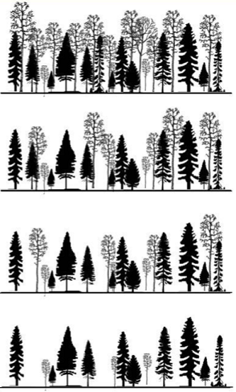
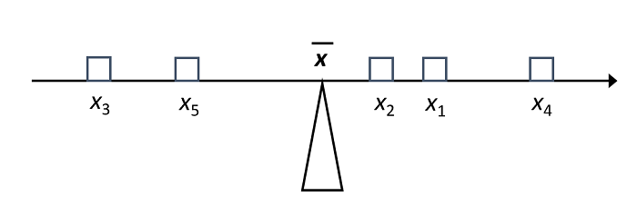
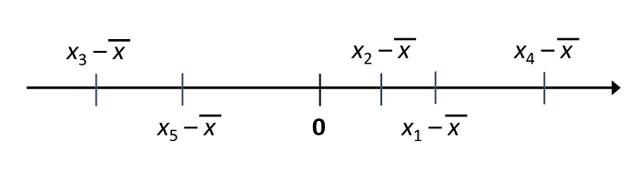
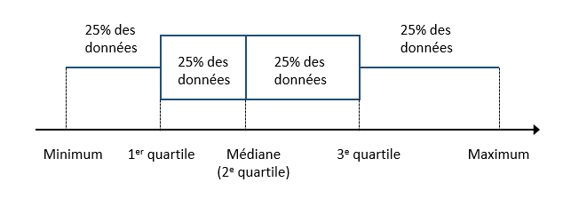
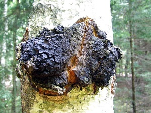
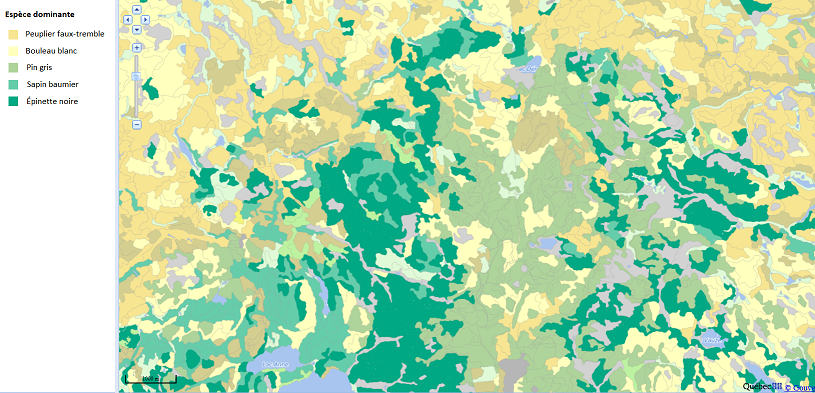
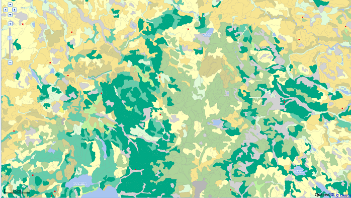
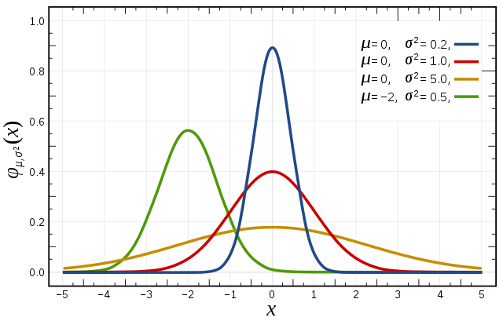

```{r setup, include = FALSE}
knitr::opts_chunk$set(echo = FALSE, message = FALSE, fig.dim = c(8, 6))
library(tidyverse)
library(cowplot)
theme_set(
  theme_cowplot(font_size = 18) +
    theme(panel.background = element_rect(fill = "#fafafa"),
          plot.background = element_rect(fill = "#fafafa"))
)
set.seed(8202)
```


# Objectifs

- Connaître les différents rôles des méthodes statistiques.

- Comprendre des concepts de base liés aux statistiques descriptives et 
aux problèmes d'estimation, de tests d'hypothèse et de régression.

- Appliquer ces méthodes aux données prises sur le terrain.


---

# Question 1

Quels sont des exemples de problèmes où nous devons faire appel aux statistiques ?

---

# Question 2

.pull-left[

Dans une forêt mixte de l'Abitibi, quel % de coupe partielle résulte en la plus grande croissance en volume après 5 ans?

.font70[
Image: Brais et al., Coupes partielles de succession, Note de recherche No. 12 de la Chaire AFD.
]

]

.pull-right[



]

---

# Différents rôles des statistiques

- *Décrire* les caractéristiques sommaires d'un ensemble de données.

--

- À partir de mesures prises sur un échantillon d'individus, *estimer* les 
caractéristiques d'une variable, ou d'une relation entre variables,
au niveau de la population. 

--

- *Tester* une hypothèse portant sur ces variables ou relations entre variables.

--

- *Prédire* la valeur d'une variable pour un nouvel individu hors de l'échantillon.
 
---

 
# Exemples de questions

- Quel est le diamètre moyen des arbres mesurés dans une parcelle?

--

- Quel est le taux de chômage à Rouyn-Noranda? Combien d'emplois seront créés l'an prochain?

--

- Combien y a-t-il d'orignaux dans le Parc de la Vérendrye? La population est-elle en croissance 
par rapport à l'année précédente?

---

# Plan du cours

- Statistiques descriptives

- Échantillonnage et estimation

- Plan d'échantillonnage ou d'expérience

- Modèles statistiques et tests d'hypothèses

- Régression

--

- Cet après-midi: mise en pratique avec vos données dans Excel.

---

class: inverse, center, middle

# Statistiques descriptives

---

# Exemple

- 1163 thuyas occidentaux dans une parcelle d'un hectare à la FERLD.

```{r, warning = FALSE}
toc <- read.csv("ferld_toc1823.csv")
select(toc, ID_ARBRE = stem_id, DHP = dbh, X = x, Y = y) %>%
  head() %>%
  knitr::kable(format = "html")
```

---

# Histogramme

.pull-left[

```{r}
ggplot(toc, aes(x = dbh)) +
  labs(x = "DHP", y = "Nombre") +
  geom_histogram(color = "white", fill = "darkorange",
                 binwidth = 5) +
  geom_rug(outside = TRUE, alpha = 0.7) +
  coord_cartesian(clip = "off") +
  scale_y_continuous(expand = c(0, 0))
```

]

--

.pull-right[

Divise l'axe des données en intervalles de même largeur et compte le nombre d'observations dans chaque intervalle.

]

---

# Moyenne

Prenons une série de données $x_1$, $x_2$, ..., $x_n$ provenant d'une variable numérique $x$ 
mesurée sur $n$ individus. 

--

$$\bar{x} = \frac{x_1 + x_2 + ... + x_n}{n} = \frac{\sum_{i = 1}^{n} x_i}{n}$$

---

# Moyenne

La moyenne constitue le "centre de gravité" des valeurs de la variable.

.center[]

---

# Moyenne

.pull-left[

```{r}
hist_moy <- ggplot(toc, aes(x = dbh)) +
  labs(x = "DHP", y = "Nombre") +
  geom_histogram(color = "white", fill = "darkorange",
                 binwidth = 5) +
  geom_vline(aes(xintercept = mean(dbh)), size = 1, alpha = 0.7) +
  scale_x_continuous(breaks = seq(0, 100, 20)) +
  scale_y_continuous(expand = c(0, 0))
hist_moy
```

]

--

.pull-right[

- DHP moyen: 14.7 cm

]

---

# Moyenne

.center[]

---


# Écart à la moyenne

.center[]

La somme des écarts à la moyenne est égale à zéro.

---

# Variance

La moyenne du *carré* des écarts à la moyenne est la variance, une mesure de la dispersion des données.

$$\sigma_x^2 = \frac{\sum_{i = 1}^{n} (x_i - \bar{x})^2}{n}$$

---

# Écart-type

La racine carrée de la variance, ou *écart-type*, a l'avantage d'avoir les même unités que les données originales (ex.: cm plutôt que cm<sup>2</sup>).

$$\sigma_x = \sqrt{\frac{\sum_{i = 1}^{n} (x_i - \bar{x})^2}{n}}$$

---

# Écart-type

.pull-left[

```{r}
hist_moy +
  geom_vline(aes(xintercept = mean(dbh) - sd(dbh)),
             size = 1, alpha = 0.7, linetype = "dashed") +
  geom_vline(aes(xintercept = mean(dbh) + sd(dbh)),
             size = 1, alpha = 0.7, linetype = "dashed")
```

]

.pull-right[

- Écart-type: 8.9 cm

]

---

# Quantiles

Statistiques basées sur le rang des données (en ordre croissant)

- Minimum et maximum

--

* Médiane

--

- Quantiles: divisent les données en $m$ groupes de la même taille.

    - Exemples: quartile si $m$ = 4, quintiles si $m$ = 5, centiles si $m$ = 100.
   
---
    
# Boîte à moustache (*boxplot*)

Représentation graphique basée sur les quartiles

.center[]

---

# Boîte à moustache (*boxplot*)

```{r}
boxp <- ggplot(toc, aes(y = dbh)) +
  labs(y = "DHP") +
  geom_boxplot() +
  coord_flip() +
  scale_x_continuous(limits = c(-1, 0.5)) +
  scale_y_continuous(breaks = seq(0, 100, 20)) +
  theme(axis.text.y = element_blank(), axis.line.y = element_blank(),
        axis.ticks.y = element_blank())

plot_grid(hist_moy, boxp, align = "v", ncol = 1, rel_heights = c(0.6, 0.4))
```


---

# Nuage de points

```{r}
xsim <- runif(80, 10, 50)
ysim <- 4 + xsim * 0.3 + rnorm(80, 0, 5)

ggplot(NULL, aes(x = xsim, y = ysim)) +
  labs(x = "x", y = "y") + 
  geom_point()
```

---

# Corrélation

Prenons deux variables $x$ et $y$ observées sur les mêmes individus.

- La corrélation (généralement notée $r$ ou $\rho$) mesure l'association entre 
les valeurs de $x$ et $y$.

--

- Si les valeurs élevées de $x$ sont plus souvent associées aux valeurs élevées de $y$, la 
corrélation est positive. Dans le cas contraire, si $x$ est moindre quand $y$ est élevée et vice versa, la corrélation est négative.

--

- La corrélation est définie de manière à être toujours comprise entre -1 et 1.

--

- Pour deux variables indépendantes (sans relation entre elles), la corrélation
est zéro, mais l'inverse n'est pas nécessairement le cas.

---

# Corrélation

.center[]

---

class: inverse, center, middle

# Échantillonnage et estimation

---

# Population

- Ex.: 1163 thuyas dans un hectare (DHP moyen: 14.7 cm, écart-type: 8.9 cm)

```{r}
hist_moy
```


---

# Échantillon

- Supposons qu'on n'ait pas mesuré tous les arbres de cette population, mais plutôt un échantillon de 25 arbres choisi de façon aléatoire.

--

- Dans ce cas, le DHP moyen de la population est une quantité inconnue qu'on veut estimer. Appelons cette quantité $\mu$.

--

- Dépendamment de l'échantillon choisi, la moyenne $\bar{x}$ ne sera pas toujours la même.

--

- Cette moyenne est donc aussi une variable aléatoire.

---

# Échantillonnage simulé

```{r}
nsim <- 1000
ech_dhp <- map_df(1:nsim, ~ data.frame(id = ., dbh = sample(toc$dbh, 25)))
dhp_moy <- group_by(ech_dhp, id) %>%
  summarize(mean_dbh = mean(dbh), sd_dbh = sd(dbh) * 25/26)
ech_dhp <- inner_join(ech_dhp, dhp_moy)
```

```{r}
ggplot(filter(ech_dhp, id <= 12), aes(x = dbh)) +
  labs(x = "DHP", y = "Nombre") + 
  geom_histogram(binwidth = 5, color = "white", fill = "darkorange") +
  facet_wrap(~ id) +
  geom_vline(aes(xintercept = mean_dbh)) +
  geom_vline(xintercept = 14.7, linetype = "dashed") +
  scale_y_continuous(expand = c(0, 0), breaks = c(0, 5, 10)) +
  coord_cartesian(xlim = c(0, 40)) +
  theme(strip.background = element_blank())
```


---

# Distribution de la moyenne

.pull-left[

- Histogramme des valeurs de $\bar{x}$ pour 1000 échantillons de 25 arbres.

```{r}
hist_ech_moy <- ggplot(dhp_moy, aes(x = mean_dbh)) +
  labs(x = "DHP moyen", y = "Nombre") +
  geom_histogram(binwidth = 0.5, color = "white", fill = "darkorange") +
  scale_y_continuous(expand = c(0, 0))
hist_ech_moy
```

]

--

.pull-right[

- Moyenne de 14.7 cm, écart-type de 1.8 cm.

]

---

# Distribution de la moyenne

- La moyenne de $\bar{x}$ sur tous les échantillons possibles est égale à $\mu$. 

--

*Note*: Cela suppose que l'échantillon est représentatif de la population (nous y revenons plus loin).

--

- On dit que $\bar{x}$ est un estimateur non-biaisé de $\mu$. 

---

# Distribution de la moyenne

- La moyenne de $\bar{x}$ sur tous les échantillons possibles est égale à $\mu$. 

- L'écart-type de $\bar{x}$ par rapport à $\mu$ mesure l'incertitude de l'estimé, dans ce contexte il se nomme *erreur-type*.

--

- L'erreur-type de $\bar{x}$, notée $\sigma_{\bar{x}}$, est égale à:

$$ \sigma_{\bar{x}} = \frac{\sigma_x}{\sqrt{n}} = \frac{\text{8.9 cm}}{\sqrt{25}} = \text{1.8 cm}$$

--

- L'erreur-type augmente proportionnellement à l'écart-type des mesures individuelles et diminue proportionnellement à la racine carrée du nombre d'observations

---

# Erreur-type vs. $n$

```{r}
ggplot(NULL, aes(x = seq(1, 10, 0.1)^2, y = 8.9/seq(1, 10, 0.1))) +
  geom_line() +
  labs(x = "n", y = "Erreur-type (cm)") +
  scale_x_continuous(expand = c(0, 0), limits = c(0, 110)) +
  scale_y_continuous(expand = c(0, 0), limits = c(0, 9), breaks = (0:3)*3)
```


---

# Estimer l'écart-type

- La formule précédente était basée sur l'écart-type exact de la population, $\sigma_x$. 

--

- En général on ne le connait pas et si on l'estime avec la formule:

$$s_x = \sqrt{\frac{\sum_{i = 1}^{n} (x_i - \bar{x})^2}{n}}$$

le résultat est biaisé, car $s_x$ sous-estime $\sigma_x$.

---

# Estimer l'écart-type

```{r}
ggplot(dhp_moy, aes(x = sd_dbh)) +
  labs(x = "Écart-type du DHP", y = "Nombre") +
  geom_histogram(binwidth = 0.5, color = "white", fill = "darkorange") +
  scale_y_continuous(expand = c(0, 0)) +
  geom_vline(aes(xintercept = mean(sd_dbh))) +
  geom_vline(xintercept = 8.9, linetype = "dashed")
  
```

---

# Estimer l'écart-type

- C'est pour corriger ce biais qu'on remplace $n$ par $n - 1$ pour calculer $s_x$.

$$s_x = \sqrt{\frac{\sum_{i = 1}^{n} (x_i - \bar{x})^2}{n - 1}}$$

--

- Pour l'erreur-type de la moyenne, on divise toujours par $\sqrt{n}$, mais on utilise la version corrigée de $s_x$.

$$s_{\bar{x}} = \frac{s_x}{\sqrt{n}}$$

---

# Stratégies d'échantillonnage

Une méthode d'échantillonnage efficace vise à produire des estimés

- non-biaisés (échantillon représentatif de la population) et

- précis (faible variation d'un échantillon à un autre).

---

# Exemple

Le chaga (*Inonutus obliquus*) est un champignon parasite du bouleau qu’on retrouve en forêt boréale.



--

Vous devez estimer l'abondance du chaga pour une région de 120 km<sup>2</sup> au nord-ouest de Rouyn-Noranda. Comment disposerez-vous des unités d'échantillonnage (placettes) dans ce territoire?

---

# Carte écoforestière




---

# Échantilonnage aléatoire simple

Chaque individu ou unité d'observation a la même probabilité de faire partie de l'échantillon. 



---

# Échantillonnage systématique

Les points d'échantillonnage sont pris à intervalles réguliers dans l'espace, sur une grille. L'origine de la grille est aléatoire.


---

# Échantillonnage systématique

- Plus efficace que l'échantillonnage aléatoire simple en présence de gradients dans l'espace.

--

- Il n'est pas toujours pratique d'échantillonner à intervalle régulier.

---

# Échantillonnage stratifié

- Diviser la population ou l'aire d'étude en strates (ex.: type de peuplement), puis effectuer un échantillonnage aléatoire simple dans chaque strate. 

--

- Moyenne pondérée si certaines strates sont sous-échantillonnées ou sur-échantillonnées par rapport à leur abondance dans la population.

--

- Plus la quantité mesurée est homogène dans chaque strate et variable entre les strates, plus l'échantillonnage stratifié est efficace par rapport à l'échantillonnage aléatoire simple.


---

class: inverse, center, middle

# Plans expérimentaux

---

# Exemple

Dans une forêt mixte de l'Abitibi, quel % de coupe partielle résulte en la plus grande croissance en volume après 5 ans?

--

- Dans un plan expérimental, on applique des traitements (ici, différentes coupes partielles) à des unités expérimentales pour comparer l'effet de ces traitements sur une réponse.

--

- Parfois, un des traitements appliqués est l'absence de traitement (*groupe témoin*).

---

# Question

- Est-ce que l'état du système avant le traitement constitue un bon témoin pour déterminer l'effet causé par le traitement?

--

- Non, car d'autres variables peuvent avoir changé en même temps.

---

# Question

- Comment décide-t-on quel traitement est appliqué à quelle unité expérimentale?

---

# Assignation aléatoire

- L'assignation aléatoire des différents traitements donne à chaque unité expérimentale la même chance d'obtenir l'un ou l'autre des traitements.

- Idéalement, la seule source de différence systématique entre les deux groupes devrait être le traitement appliqué. 

--

- Une association entre le traitement et une autre caractéristique de la population peut se produire par hasard; cette probabilité est plus grande lorsque l'échantillon est petit.

---

# Réplication

- Il est important de répliquer chaque traitement sur plusieurs unités pour séparer l'effet des traitements des autres sources de variation de la variable mesurée.

--

**Question**: Si on a trois traitements de coupe, que chacun est appliqué à une forêt, puis que la réponse est mesurée sur 10 placettes dans chacune des trois forêts, avons-nous 10 réplicats de chaque traitement?

---

# Réplication

- Non, car les réplicats ne sont pas indépendants (ils partagent certaines particularités du site non-liées au traitement). 

--

- Si on a plusieurs sites, la meilleure stratégie est de répliquer chaque traitements sur chaque site, pour séparer l'effet du traitement des effets liés au site (*expérience par blocs*).

---

class: inverse, center, middle

# Modèles statistiques et tests d'hypothèses

---


# Modèles statistiques

- Dans la méthode scientifique, un modèle est une représentation abstraite et simplifiée du système que l'on étudie.

--

- Souvent, un modèle prend la forme d'équations mathématiques qui relient différentes variables dans un système, ex.: équation pour la croissance exponentielle d'une population:

$$\frac{\Delta N}{\Delta t} = r N$$

--

- Un modèle statistique assigne une *distribution* aux variables aléatoires mesurées.

---

# Distribution

- Fonction mathématique pour déterminer la probabilité relative d'observer différentes valeurs d'une variable aléatoire.

---

# Distribution normale

```{r}
ggplot(NULL, aes(x = c(-4, 4))) +
  labs(x = "x", y = "p(x)") +
  stat_function(fun = "dnorm") +
  scale_y_continuous(expand = c(0, 0))
```


---

# Distribution normale 

- Deux paramètres ajustables: moyenne $\mu$ et écart-type $\sigma$.

.center[]

---

# Distribution normale 

- Deux paramètres ajustables: moyenne $\mu$ et écart-type $\sigma$.

- Probabilité que $x$ soit compris:

  - dans l'intervalle $(\mu - \sigma, \mu + \sigma)$: $\approx$ 68%;

  - dans l'intervalle $(\mu - 2 \sigma, \mu + 2 \sigma)$: $\approx$ 95%.

---

# Distribution normale

Une des raisons pour laquelle cette distribution est importante: la moyenne d'un échantillon tend à être normalement distribuée si cet échantillon est assez grand, même si la distribution de la variable au niveau des individus n'est pas normale.

---

# Exemple

Distribution du DHP moyen d'un échantillon de 25 thuyas de notre parcelle de la FERLD.

```{r}
xseq <- seq(8, 24, 0.1)
hist_ech_moy +
  annotate(geom = "line", x = xseq, y = dnorm(xseq, 14.7, 1.9) * 500)
```

---

# Intervalle de confiance

Connaissant l'erreur-type et supposant une distribution normale, on peut évaluer la probabilité que l'estimé de la moyenne $\bar{x}$ soit à une certaine distance de la moyenne de la population $\mu$. 

--

Par exemple, il y a une probabilité d'environ 95% que $\bar{x}$ se trouve à $\pm$ 1.96 erreurs-type de $\mu$.

$$\left( \mu - 1.96 \frac{\sigma}{\sqrt{n}}, \mu + 1.96 \frac{\sigma}{\sqrt{n}}\right)$$

---

# Intervalle de confiance

Si on définit un intervalle de même largeur autour de l'estimé $\bar{x}$:

$$\left( \bar{x} - 1.96 \frac{\sigma}{\sqrt{n}}, \bar{x} + 1.96 \frac{\sigma}{\sqrt{n}}\right)$$

alors pour 95% des échantillons possibles, $\mu$ sera compris à l'intérieur de l'intervalle
défini ainsi.

---

# Intervalle de confiance

[Site web *Seeing Theory*](https://seeing-theory.brown.edu/frequentist-inference/index.html#section2)

---

# Tests d'hypothèse

- Supposons qu'on réalise une expérience pour tester l'effet d'un traitement sur la variable $x$. On choisit au hasard un groupe d'individus traités et un groupe où ils ne sont pas traités (groupe témoin).

--

- *Hypothèse nulle* $H_0$: modèle de base auquel on compare le résultat d'une expérience. Ex.: Selon $H_0$, le traitement n'a aucun effet sur une variable $x$ donnée.

--

- Donc selon $H_0$, les deux groupes sont simplement deux échantillons aléatoires tirés de la même population.

---

# Tests d'hypothèse

- La différence de moyenne entre deux échantillons de la même population suit aussi une distribution normale.

--

- Définir un intervalle de confiance (le plus souvent à 95%) pour la différence entre la moyenne du groupe témoin et du groupe traité.

--

- Si la valeur de 0 est dans cet intervalle, la différence observée est jugée compatible avec l'hypothèse nulle.

- Si la valeur de 0 est hors de l'intervalle, l'hypothèse nulle est rejetée. On dit dans ce cas que la différence entre les deux groupes est statistiquement significative.

---

# Tests d'hypothèse

- Valeur $p$: probabilité d'avoir un résultat plus éloigné de la valeur attendue (ici, 0) sous l'hypothèse nulle. 

--

- Ex.: Si $p = 0.01$, alors seulement 1% des échantillons produiraient une différence aussi éloignée de 0 si $H_0$ était correcte.

- Lien entre intervalle de confiance valeur $p$. Ex.: si $p < 0.05$, l'intervalle de confiance à 95% exclut 0.
 
---

# Notes sur le tests d'hypothèse

- Visent à déterminer si un résultat est compatible avec l'hypothèse nulle, ou s'il est si improbable selon cette hypothèse qu'il faudrait la rejeter. 

--

- Une différence statistiquement significative n'est pas nécessairement importante. La significativité de l'importance de l'effet réel, mais aussi de la variabilité des mesures et de la taille de l'échantillon. 

--

- Avec un assez grand échantillon, même des différences très faibles peuvent être jugées significatives.

--

- Pour qu'un test soit valable, il faut que la distribution des données et le processus d'échantillonnage respectent les suppositions du test (ex.: distribution normale de la moyenne, assignation aléatoire des traitements aux individus).

---

class: inverse, center, middle

# Régression

---

# Régression

- Modèle qui définit une relation entre une variable *réponse* $y$ et un ou plusieurs *prédicteurs*: $x_1$, $x_2$, etc.

--

- Les prédicteurs expliquent une partie de la variation de la réponse; l'autre partie, $\epsilon$, est le *résidu* aléatoire.

$$ y = f(x_1, x_2, ...) + \epsilon $$

---

# Régression linéaire

Prenons l'exemple du nuage de points vu auparavant.

```{r}
ggplot(NULL, aes(x = xsim, y = ysim)) +
  labs(x = "x", y = "y") + 
  geom_point()
```

---

# Régression linéaire

- La régression linéaire simple relie $y$ à un prédicteur $x$ et suppose que la relation est linéaire (représentée par une droite).

$$y = a + bx + \epsilon$$

--

- $a + bx$: valeur moyenne de $y$ pour un $x$ donné;

- $\epsilon$: variation résiduelle des individus, suit une distribution normale.

--

- Objectif: choisir les valeurs des *paramètres* $a$ et $b$ qui minimisent la taille des résidus, i.e. la variance de $\epsilon$.

---

# Régression linéaire

```{r}
ggplot(NULL, aes(x = xsim, y = ysim)) +
  labs(x = "x", y = "y") + 
  geom_point() +
  geom_smooth(method = "lm", se = FALSE)
```

---

# Régression linéaire

**Question**: Comment interpréter les paramètres $a$ et $b$ dans l'équation $y = a + bx$ ?

--

- $a$: Valeur moyenne de $y$ pour les individus où $x = 0$.

- $b$: Différence moyenne de $y$ entre deux individus qui diffèrent d'une unité sur l'axe $x$. 

---

# Régression linéaire

- Coefficient de détermination $R^2$: portion de la variance de $y$ expliquée par le ou les prédicteurs. 

--

- Si $\sigma^2_y$ représente la variance de la réponse $y$ et $\sigma^2_{\epsilon}$ représente la variance des résidus, alors:

$$R^2 = 1 - \frac{\sigma^2_{\epsilon}}{\sigma^2_y}$$

--

- Pour une régression linéaire simple, $R^2$ est égal au carré de la corrélation entre $x$ et $y$.

---

# Résumé

- Graphiques pour la distribution des valeurs mesurées d'une variable (histogramme, boîte à moustaches) ou de deux variables (nuage de points).

--

- Statistiques sommaires: moyenne, variance, écart-type, médiane, quantiles.

--

- Estimation de la moyenne: erreur-type, intervalle de confiance.

--

- Plans d'expérience: groupe témoin, assignation aléatoire, réplication.

--

- Test d'hypothèse: hypothèse nulle, valeur $p$.

--

- Régression linéaire: interprétation des coefficients, $R^2$.

